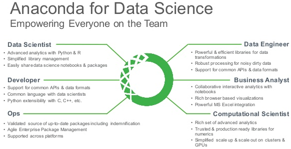

Role conda readme
==============




This role is used to install, configure conda environment and add libs with anaconda or miniconda.

Install and configure conda and let you create python virtual environments :
 * Installing anaconda.
 * Configure remote repository server
 * Create virtual environment
 * Add lib in virtual environment with pip,conda or local repo
 * Add somes data lib (like NLTK)

For using this role you have to use variable "state" to execute the following actions :
 1. __role_conda_install__ :
   * Installing anaconda or miniconda 

 2. __role_conda_config__ :
   * Set conda home in root bash_profile and add it in path environment
   * Set default anaconda channel repository for root user
   * Set default pip repository for root user

 3. __role_conda_pyenv__ :
   * Create/Remove python virtual environments

 4. __role_conda_pylib__ :
   * Add/remove python library for python virtual environments

 5. __role_conda_remove__ :
   * Remove anaconda or miniconda
 
 6. __role_conda_whole_install__ :
   * shortcut that include **role_conda_install** , **role_conda_config** , **role_conda_pyenv** and **role_conda_pylib**

This role is developped for Big Data. 
Some updates may have to be done for other needs, you could contact us by creating an issue or Fork it and pulling a request.

If you want to collaborate, please read the following :  
[Contributing.md](CONTRIBUTING.md)
And

Requirements
------------
Facts gathering shouldn't be disabled.

Target servers must be RHEL7+.

Role Variables
--------------

Here are the requested values for each TAG :

__role_conda_install__
   - role_conda_path_conda_exe
   - role_conda_installer_url
   - role_conda_tempory_path
   - role_conda_installer_sh
   - role_conda_download_timeout_seconds
   - role_conda_parent_dir
   - role_conda_root_conda
   - role_conda_hosted_repos

__anaconda_config__
   - role_conda_root_home
   - role_conda_path_bin
   - role_conda_config_conda
   - role_conda_pip_directory
   - role_conda_pip_config
   - role_conda_pip_index_url

__anaconda_pyenv__
- anaconda_parent_dir
- anaconda_dir_name
- pyenvs

__anaconda_pylib__
- anaconda_tempory_path
- anaconda_parent_dir
- anaconda_dir_name
- pyenvs

__anaconda_whole_install__
- anaconda_installer_url
- anaconda_installer_sh
- anaconda_installer_checksum
- anaconda_download_timeout_seconds
- anaconda_parent_dir
- anaconda_dir_name
- anaconda_tempory_path
- anaconda_remote_repo
- root_home
- pip_index_url
- pip_trusted_host
- pyenvs

Dependencies
------------
None


Example Inventory
-----------------

`~/inventory/inventory.yml`:

```yml
[hosts]
host01
host02
```

Example Playbook 
----------------

`~/deploy_conda.yml`:

```yml
  - hosts: hosts
    gather_facts: yes
    roles:
    - { role: role_conda}
```

Example variables
-----------------

```yml
anaconda_installer_url: "http://<my_repos_host>/repo/binaries/Anaconda3-4.3.1-Linux-x86_64.sh"  # url for anaconda binary 
anaconda_parent_dir: "/applis/hadd/produits"    # Base path for anaconda installation
anaconda_remote_repo : http://<my_repos_host>/repo/pyrepos/conda/free # url for anaconda repo
pip_index_url: http://<my_repos_host>/repo/pyrepos/pip # url for pip repo
pip_trusted_host: <my_repos_host> # pip server name
```

Python virtual environment description
----------------------------------------

you have to describe your virtual environment as pyenvs table structure variable like the following :

```yml
pyenvs:
  - name: "py27" #your environment name
    version: "2.7" # the python version
    description: "anaconda" # your environment description (will be displayed in jupyter)
    state: present # present if your want to create the environment / absent if your want to remove it
    extras: (optional, only used with conda type) allow to add extra arguments like setting additional channels (eg: extras: "-c conda-forge" ) 
    url: (only required for local type) use to fetch python lib source from repository server
    libs: # the python libraries to install or remove
       # name : the python lib
       # type : conda  when using conda binary, pip for pip binary or local for install from sources
       # state : present to install the lib / absent to remove the lib
      - {name: "nltk", type: "conda", state: "present"}
      - {name: "pandas", type: "conda", extras: "-c conda-forge", state: "present"}
      - {name: "sklearn", type: "pip", state: "present"}
      - {name: "cpickle", type: "local", url: "http://<my_repos_host>/resources/pyrepos/sources/sklearn-theano.zip", state: "present"}
  - name: "py35"
      version: "3.5"
      description: "anaconda"
      state: present
      libs:
        # name : the python lib
        # type : conda  when using conda binary or pip for pip binary
        # state : present to install the lib / absent to remove the lib
        - {name: "nltk", type: "conda", state: "present"}
        - {name: "pandas", type: "conda", extras: "-c conda-forge", state: "present"}
        - {name: "sklearn", type: "pip", state: "present"}
        - {name: "cpickle", type: "local", url: "http://<my_repos_host>/resources/pyrepos/sources/sklearn-theano.zip", state: "present"}
....
```

Example script shell to execute the actions
-------------------------------------------
```bash
#!/bin/bash
ansible-playbook deploy_anaconda.yml -i inventory/inventory.yml -c paramiko -e "state=role_conda_whole_install"
```

License
-------
[] (https://fr.wikipedia.org/wiki/Licence_BSD)

Author Information
------------------

Franck VIEIRA
Cedric Edouard KASSI
